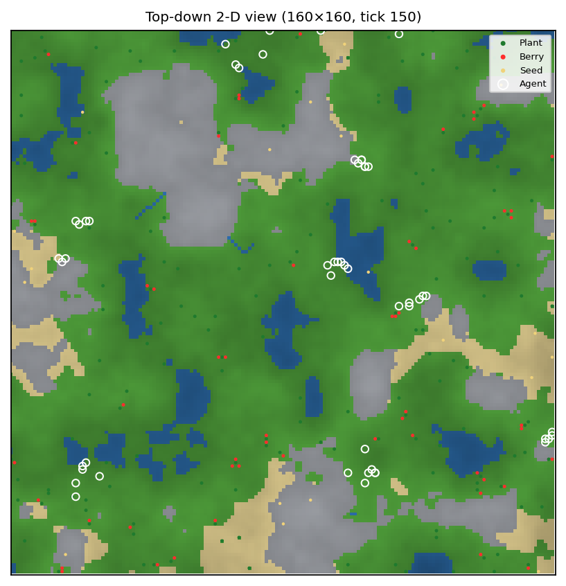
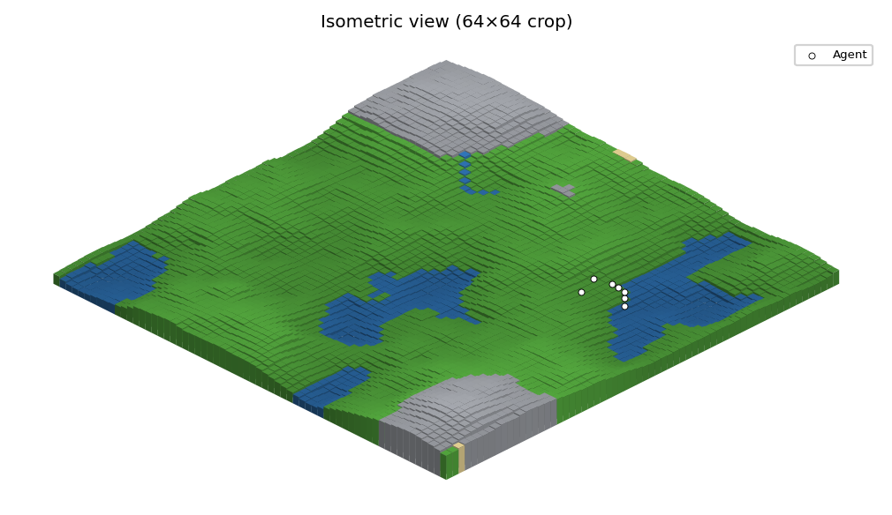
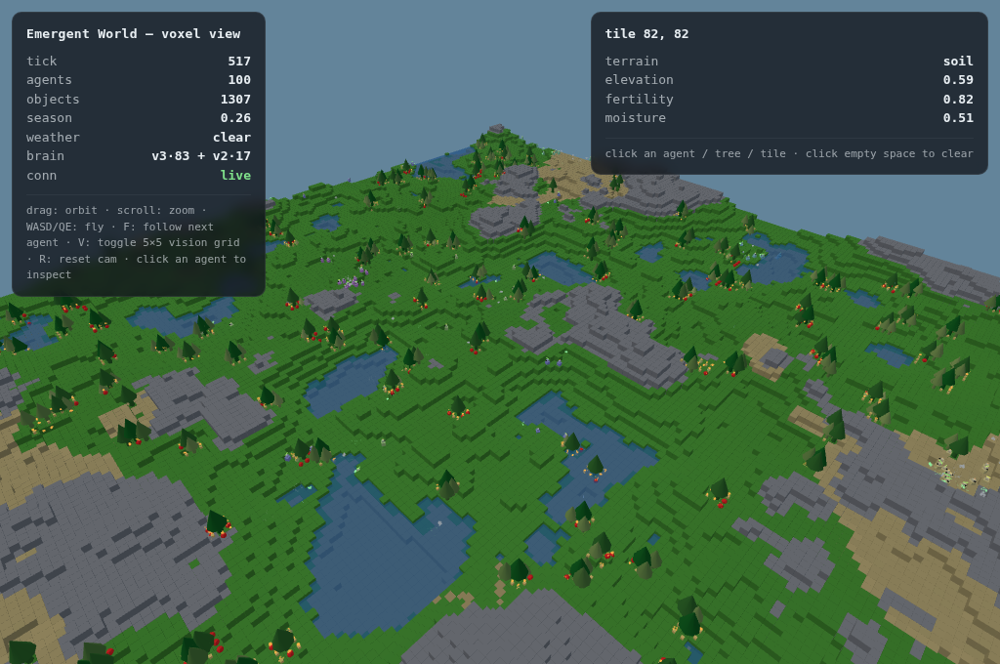

<!-- Canonical, typeset version (two-column, figures): ../paper/emergent_world_model.pdf
     Source: ../paper/paper.html · figures: ../paper/figures/ · rebuild: ../paper/README.md
     This markdown is the mirror. All data tables are inline and complete. -->

# How Useful Is a Learned World Model? Planning, Replication, and Model-Quality Diagnostics in a Multi-Agent Evolutionary Sandbox

**Karan Vasa** — Independent Researcher
Project: *Emergent World-Model Sandbox* · Code: `starkdv/emergent-world-model-sandbox`

> 📄 The **typeset two-column PDF with all figures** is
> [`paper/emergent_world_model.pdf`](../paper/emergent_world_model.pdf). This
> markdown mirrors it. Every number reported below appears in full in this
> document — per-seed, per-run — so the paper is self-contained.

---

## Abstract

We study populations of recurrent neural agents that forage, learn within their
lifetime by PPO, and reproduce with Lamarckian inheritance of trained weights in a
procedurally generated 2-D ecology, and we use this sandbox to ask a question that
is usually settled by assumption: **when does a learned world model actually help
an agent act?** We report the full experimental arc, including the reversals.
(1) In ecological competition, an attention-based brain displaces a legacy
recurrent brain, growing from 1/8 founders to 96% of the population (mean fitness
10.57 vs 8.95). (2) An observation-space world model trained on 291k logged
transitions beats a static-world baseline by 20% (held-out ΔMSE 0.0268 vs 0.0337)
and explains ≈67% of reward variance. (3) Equipping each agent with a latent
dynamics head used for planning and curiosity produces a large single-seed
behavioural shift (peak fitness +49%, exploration ×2). (4) A single-seed planner
ladder — policy-guided rollouts (P1), cross-entropy-method search (P2), and
Dreamer-style imagination (P3) — appears to give further stacked gains (+21%,
+32%, +25%). (5) **Four-seed replication then erases most of it**: only P1
survives (peak 43.5 ± 4.0 vs 41.1 ± 4.9; final fitness 51.8 ± 3.7 vs 45.3 ± 13.7
at equal speed); P2 and P3 gains were seed noise. (6) A warmup schedule that gates
the model-heavy methods on training time wins a 2-seed pilot but **loses a 4-seed
confirmation at 7,000 ticks on every metric** (baseline peak 86.7 ± 8.4 vs
72–77 for all scheduled variants). (7) We therefore instrument the model itself:
a k-step open-loop rollout-error diagnostic measured during training, a
readiness gate that switches planners on *measured* error instead of a tick count,
and a multi-step consistency training loss that trains the dynamics head in the
compounding-error regime the planner actually uses. The diagnostic shows the
per-agent model's open-loop error at planner depth, and the multi-step loss
reduces it. The overall lesson is methodological as much as algorithmic: a weak
model can be genuinely useful (for exploration and action ranking), sharper
search on the same weak model is *worse* than blunt search, single-seed effect
sizes in ecological simulations routinely evaporate under replication — and the
model's open-loop error is the quantity to measure before trusting any of it.

**Keywords:** multi-agent RL · world models · model-based planning · replication ·
model error · intrinsic motivation · open-ended evolution

---

## 1. Introduction

Reinforcement-learning agents are usually trained one policy at a time against a
fixed task, with a learned "world model" either absent or assumed helpful. This
work studies *populations* of agents that live, learn during their lifetime, and
reproduce with inheritance of learned weights, so selection and individual
learning act together and behaviour is *observed* rather than rewarded into
existence. Into this sandbox we introduce a per-agent latent world model and ask,
with matched A/B runs and multi-seed replication, what it is actually good for.

The contributions are:

1. **A complete, reproducible sandbox** — procedural ecology, three brain
   generations under one append-only genome contract, PPO with full-network
   backprop through a GRU, Lamarckian inheritance, and three live visualizations
   (2-D, isometric, browser voxel).
2. **Measured capabilities**: architecture selection by ecological competition;
   an offline population world model with quantified accuracy; a
   planning+curiosity phase change in agent behaviour.
3. **A replication study of planner upgrades** (policy-guided rollouts, CEM,
   imagination, warmup scheduling) whose headline is honest: most single- and
   two-seed wins did not survive four seeds; policy-guided rollouts did.
4. **A model-quality toolkit** motivated by the failures: a k-step open-loop
   rollout-error diagnostic computed during training, an error-threshold
   readiness gate for model-based planners, and a multi-step consistency
   training loss — with measurements showing the diagnostic tracks training and
   the loss reduces open-loop error at planner depth.

## 2. Related work

World models and latent imagination: Ha & Schmidhuber [1], PlaNet [3], Dreamer
[2, 4]. Decision-time planning: random-shooting MPC / PETS [5], MPPI [6], MuZero
[7], MBPO [8]. Policy optimisation: PPO [9] with GAE [10], A2C/A3C [11].
Curiosity from prediction error: ICM [12], RND [13]. Perception and memory:
attention [14], GRU [15]. Evolutionary substrate: NEAT-style neuroevolution [16]
and novelty metrics [17]. The failure mode we measure — a planner exploiting the
compounding open-loop error of a model trained one step at a time — is the
objective-mismatch problem [19]; our multi-step consistency loss follows the
data-as-demonstrator insight of training on the model's own predictions [18].
Our realizations are intentionally the simplest instances of each idea.

## 3. The sandbox

### 3.1 World generation

Each world is procedurally generated: layered value noise → an elevation field;
downhill tracing from high-elevation sources carves **rivers**; **biomes**
(soil / sand / water / rock) derive from elevation plus a moisture field with
fertile corridors along rivers; an **ecology pass** seeds plants that grow
through seed → sprout → mature stages, fruit into berries, and drop seeds that
germinate under a neighbourhood carrying-capacity cap (≤3 plants within radius
2). The default experimental arena is 64×64 with soil/rock/water/sand ratios
0.62/0.18/0.12/0.08.

### 3.2 World dynamics

Per tick: a day/night cycle (length 200) modulates light; seasons (length 2,000)
modulate temperature; weather switches between rain (recovering soil moisture)
and drought (evaporation ×2); optional wildfire ignites, spreads against a
moisture threshold, and returns nutrients; soil fertility/moisture relax slowly
toward equilibrium; plants consume fertility and moisture as they grow. Agents
pay a metabolism cost scaled by temperature, eat berries (+20 energy), can plant
seeds (−5 energy), and die at zero energy or `max_age` 1,000, returning 15% of
consumed fertility to the soil. Water is impassable. Reproduction is energetic:
above 45% of max energy and age ≥ 50, an agent splits 40% of its energy into an
offspring whose genome is the parent's trained weights plus Gaussian mutation
(σ = 0.02), capped at 30 alive agents.

### 3.3 Observability: three live views

The same live world is observable three ways, all fed by one read-only state
bridge that never affects dynamics: a top-down 2-D biome/elevation map, an
isometric 2.5-D render, and an interactive in-browser **voxel** client streamed
over server-sent events (terrain columns, trees that scale with plant maturity,
berries, seeds, agents with follow-markers and vision-grid overlays, weather,
and a live HUD reporting the population's brain mix). Every study below was
spot-checked visually in at least one of these viewers.

|  |  |  |
|:--:|:--:|:--:|
| (a) top-down 2-D | (b) isometric 2.5-D | (c) interactive voxel (live) |

## 4. Agents

### 4.1 Three brain generations, one genome contract

| Brain | Obs dim | Actions | Params | Core |
|---|---|---|---|---|
| v2 (legacy) | 72 | 8 | ≈8.9k | dense encoder → GRU → policy/value |
| v3 (attention) | 72 | 8 | ≈17.3k | tokenised 5×5 vision + attention pooling → GRU → value on [z,h] |
| v3.5 (social) | 78 | 9 | ≈21.1k | v3 + 6 social/climate inputs + SIGNAL action + pheromone field |

All three share an **append-only** genome layout, so a saved population trained
under one version can be migrated forward and compete in a shared world.

**Architecture (v3/v3.5).** Each of the 25 vision tiles is embedded by one shared
matrix (position codes appended, so the embedding is position-equivariant); a
single state-conditioned attention query pools the 25 tile tokens [14]; the
latent is *z = [state-encoding | pooled-vision]*; a GRU [15] carries memory *h*;
the policy head reads *h*; the value head reads *[z, h]*.

### 4.2 Lifetime learning

PPO [9] on stored sequences (seq_len 8, GAE λ = 0.95, clip 0.2, entropy 0.01, lr
3e-4, 1 epoch per update) with **full-network backprop** — gradients flow through
the policy and value heads, the GRU through time, and the attention encoder. A
global scheduler staggers agent updates across ticks. On update completion the
trained weights are written back into the genome (**Lamarckian**), so offspring
inherit learned behaviour. Newborns get fading instinct biases (eat-when-hungry,
approach-food) that decay to zero by age 150, scaffolding early survival without
constraining adult behaviour.

### 4.3 The per-agent latent world model

When enabled, the genome grows a dynamics head *g(h, a) → (ẑ′, r̂)* — a
one-hidden-layer MLP (width 32) mapping the current GRU hidden state and a
one-hot action to a predicted next latent and reward. It trains as an auxiliary
loss in the same PPO update: predict the (stop-gradient) next latent and the
observed reward at every stored step. The head powers three consumers:

- **Planning** — receding-horizon control in latent space (Sec. 5).
- **Curiosity** — an ICM-style intrinsic reward [12] proportional to the
  z-scored latent prediction error.
- **Imagination** — Dreamer-style actor-critic training on imagined rollouts
  (Sec. 5.4).

### 4.4 The offline population world model

Separately, a population-level model *f(o, a) → (Δo, r̂, p_done)* (two tanh
layers, 128 hidden) trains offline by regression on logged transitions from full
runs [1], giving a measurable reference point for what these small models can
learn (Sec. 6.2).

## 5. Planning methods

The planner is receding-horizon model-predictive control in latent space: from
the current hidden state *h*, imagine *S* candidate action sequences of depth
*D* through the dynamics head, score each by discounted imagined reward plus a
terminal value bootstrap, execute the best first action, and (by default) replan
next tick. All variants below are config-gated and off by default; the legacy
configuration is reproduced exactly by the defaults.

**5.1 Shooting (baseline).** First actions drawn uniformly from the valid-action
mask; continuation actions uniform-random [5]. Depth 2, 6 samples per decision
in all experiments below.

**5.2 P1 — policy-guided rollouts.** Continuation actions are sampled from the
agent's *own policy* evaluated at the imagined latent state (Dreamer-style [2]):
rollouts stay in-distribution and have lower variance. Optional first-action
biasing (`policy`, `policy_topk`), reward/value z-scoring, and plan commitment
(execute the first *c* actions before replanning) are implemented; the P1
experiments use uniform first actions, no normalisation, commit 1.

**5.3 P2 — cross-entropy method.** A categorical distribution per rollout step
is refined over 3 iterations: sample the population, keep the top 30% elites,
refit smoothed action frequencies [5, 6]. TD(λ) scoring over the imagined
trajectory is implemented (λ = 1, the reward-sum + bootstrap, is used below).

**5.4 P3 — imagination actor-critic.** A Dreamer-style loss [2]: from detached
real hidden states, the actor rolls forward 5 steps in the dynamics head;
TD(λ) returns from the critic score the imagined trajectory; REINFORCE with a
value baseline trains the actor, regression trains the critic. Planning is thus
*distilled into the policy* instead of paid for at decision time.

**5.5 Warmup scheduling.** At tick 0 the world model is untrained, so
model-heavy planning "shoots off" a garbage model. The planner can run a cheap
exploratory strategy (P1) until `warmup_ticks`, then switch to the configured
strategy (e.g. CEM); imagination is gated the same way.

**5.6 Model-quality toolkit (this work).** Three mechanisms motivated by the
replication results (Sec. 6.5–6.6):

- **k-step rollout-error diagnostic.** Every learner update, roll the dynamics
  head **open-loop** for k steps from real hidden states — feeding its own
  predictions back through the GRU, taking the *logged real actions* — and
  measure the latent MSE against the real encoded latents at each horizon.
  This is exactly the compounding-error regime the planner operates in, and it
  is measured on-line, per agent, for free (no extra rollouts of the world).
  The population mean is logged per generation.
- **Readiness gating.** Instead of a blind tick count, the planner switches to
  its main strategy when the measured error EMA drops below a threshold
  (latched; `warmup_ticks` becomes a switch-anyway deadline).
- **Multi-step consistency loss.** The standard auxiliary loss trains
  *one-step* prediction only, leaving compounding error unconstrained [18, 19].
  The multi-step loss rolls the head open-loop for k steps on stored sequences
  and penalises latent/reward error at horizons 2..k (horizon 1 being the
  standard loss).

## 6. Experiments and results

Throughout: "peak fitness" is the highest per-generation mean agent fitness seen
during a run; "final fitness" is the last generation's mean; "tiles" is unique
tiles visited per agent; "EAT" counts successful eat actions; "seeds" counts
seeds planted; ticks/s is single-core throughput including learning. All
planning runs: 64×64 world, v3.5 + PPO, world-model head on, curiosity off,
population cap 30, `generation_length` 1,000.

### 6.1 Ecological competition between architectures

One 160×160 world, 8 founders (1 v2, 7 v3), offspring breed true, 4,000 ticks,
population cap 100. The attention brain displaces the legacy brain: final
population {v3: 96, v2: 4}.

| Cohort | Agents over run | Mean age | Max age | Mean fitness | Eat success |
|---|---|---|---|---|---|
| v2 (legacy) | 255 | 98.3 | 259 | 8.95 | 100% |
| **v3 (attention)** | **1715** | **101.3** | **493** | **10.57** | 100% |

### 6.2 Accuracy of the offline world model

291,300 transitions logged from a v3.5+PPO run (64×64, pop 30; all 9 actions
exercised, 67k SIGNALs). Training: 20 epochs, loss 3.20 → 1.71. Held-out
evaluation:

| Metric | Model | Baseline / scale | Reading |
|---|---|---|---|
| Δo MSE | **0.0268** | 0.0337 (predict Δ=0) | 20% below static-world baseline |
| Reward MSE | **1.70** | reward variance 5.15 | ≈67% of variance explained |
| `done` accuracy | **0.999** | — | termination solved |

The model is real but modest: 20% better than "nothing changes." That number
should be kept in mind for everything that follows.

### 6.3 Planning + curiosity: a behavioural phase change (single seed)

Matched A/B (seed 42, 3,000 ticks): identical worlds and learning; the treatment
adds the dynamics head + shooting planner + curiosity.

| Metric | Baseline | +Plan & curiosity | Δ |
|---|---|---|---|
| Avg peak fitness | 38.7 | **57.8** | +49% |
| Mean fitness (final) | 40.8 | **70.7** | +73% |
| Avg lifespan | 422 | **548** | +30% |
| Mean energy (final) | 109 | **165** | +51% |
| Tiles explored / agent | 27.7 | **54.9** | +98% |
| EAT attempts | 185 | **1196** | ×6.5 |
| Seeds planted | 226 | **929** | ×4.1 |
| Turning (L+R) share | 51% | 36% | −15 pt |
| Strategy entropy | 1.61 | **2.44** | +0.83 |
| Pairwise novelty | 0.320 | 0.092 | converges |

Behaviour flips from aimless turning to the forage → eat → plant loop; per-agent
strategy entropy rises while pairwise novelty falls — the population converges
on the same effective strategy [17]. This is the honest headline for a weak
model: it doubled exploration and halved idling *despite* being only 20% better
than chance, because ranking actions and flagging surprise demand far less of a
model than accurate simulation does.

### 6.4 The planner ladder, single seed: an apparent staircase

Matched single-seed A/Bs (seed 42, 2,000 ticks, depth 2, 6 samples):

| Variant | rollouts/decision | peak fitness | EAT | seeds | WAIT share | ticks/s |
|---|---|---|---|---|---|---|
| shooting (baseline) | 6 | 33.8 | 306 | 230 | 21.9% | 6.54 |
| policy_shooting (P1) | 6 | **41.1** (+21%) | 341 | 289 | 22.6% | 6.35 |
| **cem (P2)** | 18 (3×6) | **44.5** (+32%) | **487** | **396** | 26.9% | 5.19 |

And the imagination A/B (seed 42, 2,000 ticks, planner OFF in both arms — the
only difference is the imagination loss):

| Metric | no imagination | + imagination (P3) | Δ |
|---|---|---|---|
| Avg peak fitness | 32.6 | **40.6** | +25% |
| Mean fitness (final) | 45.9 | **48.2** | +5% |
| Avg lifespan | 403 | **450** | +11% |
| Seeds planted | 61 | **84** | +38% |
| WAIT share | 31.0% | **15.4%** | −16 pt |
| ticks/s | 9.05 | 7.22 | −20% (training only) |

Taken at face value this is a clean staircase: each rung of model-based
sophistication buys more fitness. Sec. 6.5 is why face value is not enough.

### 6.5 Four-seed replication: the staircase collapses

The identical five arms re-run at seeds 1–4 (2,000 ticks each; 20 runs). Full
per-seed data:

| seed | variant | peak | lifespan | tiles | EAT | seeds | final | ticks/s |
|---|---|---|---|---|---|---|---|---|
| 1 | shooting | 33.15 | 409.0 | 40.7 | 108 | 156 | 30.05 | 5.57 |
| 1 | policy_shooting | 43.12 | 453.2 | 50.4 | 562 | 318 | 55.96 | 6.90 |
| 1 | cem | 51.89 | 503.3 | 49.7 | 640 | 395 | 51.02 | 4.96 |
| 1 | imag_off | 33.74 | 395.4 | 14.6 | 65 | 326 | 41.51 | 8.37 |
| 1 | imag_on | 28.10 | 384.9 | 28.9 | 123 | 229 | 27.11 | 6.58 |
| 2 | shooting | 41.25 | 463.9 | 38.9 | 328 | 283 | 35.26 | 6.62 |
| 2 | policy_shooting | 45.26 | 449.2 | 38.6 | 504 | 519 | 47.69 | 6.15 |
| 2 | cem | 39.67 | 456.7 | 47.8 | 263 | 428 | 26.75 | 5.10 |
| 2 | imag_off | 31.52 | 364.5 | 16.5 | 125 | 101 | 22.04 | 8.85 |
| 2 | imag_on | 32.65 | 436.4 | 13.1 | 156 | 63 | 36.36 | 6.62 |
| 3 | shooting | 45.74 | 467.6 | 39.8 | 738 | 383 | 51.23 | 6.76 |
| 3 | policy_shooting | 48.34 | 478.9 | 40.2 | 779 | 393 | 48.40 | 6.69 |
| 3 | cem | 35.10 | 446.3 | 33.3 | 174 | 179 | 27.10 | 5.29 |
| 3 | imag_off | 34.49 | 430.0 | 41.5 | 328 | 274 | 45.25 | 8.81 |
| 3 | imag_on | 41.22 | 443.0 | 19.5 | 153 | 252 | 36.54 | 6.85 |
| 4 | shooting | 44.42 | 466.3 | 46.0 | 355 | 320 | 64.81 | 6.92 |
| 4 | policy_shooting | 37.32 | 438.8 | 42.2 | 248 | 185 | 54.98 | 5.99 |
| 4 | cem | 37.66 | 426.9 | 49.5 | 254 | 268 | 33.25 | 4.73 |
| 4 | imag_off | 39.32 | 426.9 | 31.2 | 242 | 147 | 46.03 | 8.33 |
| 4 | imag_on | 39.10 | 397.5 | 51.4 | 440 | 551 | 39.32 | 6.85 |

Aggregates (mean ± std over 4 seeds):

| Variant | peak fitness | final fitness | EAT | seeds | ticks/s |
|---|---|---|---|---|---|
| shooting | 41.1 ± 4.9 | 45.3 ± 13.7 | 382 ± 227 | 286 ± 83 | 6.5 |
| **policy_shooting (P1)** | **43.5 ± 4.0** | **51.8 ± 3.7** | **523 ± 189** | **354 ± 121** | 6.4 |
| cem (P2) | 41.1 ± 6.4 | 34.5 ± 9.9 | 333 ± 181 | 318 ± 100 | 5.0 |
| imag_off | 34.8 ± 2.8 | 38.7 ± 9.8 | 190 ± 102 | 212 ± 91 | 8.6 |
| imag_on (P3) | 35.3 ± 5.2 | 34.8 ± 4.6 | 218 ± 129 | 274 ± 176 | 6.7 |

Three findings:

- **P1 survives replication.** Policy-guided rollouts beat the baseline on mean
  peak (43.5 vs 41.1), on final fitness with far lower variance (51.8 ± 3.7 vs
  45.3 ± 13.7), on eating and planting — at equal speed. The mechanism is
  plausible and cheap: in-distribution continuations reduce rollout variance
  without extra rollouts.
- **P2's +32% was one seed.** Across seeds CEM *ties* the baseline on peak
  (41.1 ± 6.4) and is clearly worse on final fitness (34.5 ± 9.9) while running
  ~23% slower. Its seed-1 win (51.9) is bracketed by losses at seeds 2–4.
- **P3's +25% was noise.** Imagination on vs off: 35.3 ± 5.2 vs 34.8 ± 2.8 —
  indistinguishable, at a 22% throughput cost.

### 6.6 Warmup scheduling: a hypothesis, a pilot win, and an honest reversal

**Hypothesis.** P2/P3 fail from a *cold start*: at tick 0 the dynamics head is
random, so CEM optimises fantasies and imagination trains the actor on garbage.
Gate them on model training time and they should work.

**Pilot (2 seeds, 6,000 ticks, 3 arms).** baseline (shooting throughout); naive
(CEM + imagination from tick 0); scheduled (P1 until tick 5,000, then CEM +
imagination). Full data:

| seed | variant | peak | lifespan | tiles | EAT | seeds | final | ticks/s |
|---|---|---|---|---|---|---|---|---|
| 1 | baseline | 74.47 | 721.8 | 64.0 | 2225 | 1818 | 51.69 | 5.10 |
| 1 | naive | 52.35 | 620.5 | 70.5 | 925 | 1015 | 40.77 | 3.24 |
| 1 | scheduled | 77.90 | 701.6 | 85.1 | 2372 | 2532 | 46.19 | 4.35 |
| 2 | baseline | 41.11 | 415.2 | 42.9 | 1805 | 1394 | 41.30 | 5.23 |
| 2 | naive | 73.34 | 713.1 | 64.4 | 2047 | 1260 | 52.92 | 3.36 |
| 2 | scheduled | 55.14 | 645.9 | 58.8 | 1168 | 803 | 51.20 | 4.17 |

Scheduled beat baseline on *both* seeds (77.9 > 74.5; 55.1 > 41.1), mean peak
66.5 ± 11.4 vs 57.8 ± 16.7, while cold-start was a coin flip (lost seed 1 badly,
won seed 2). The hypothesis looked confirmed.

**Confirmation + switch-point sweep (4 seeds, 7,000 ticks, 16 runs).** Arms:
baseline, and scheduled with the switch at 4k / 5k / 6k ticks. Full data:

| seed | arm | peak | lifespan | tiles | EAT | seeds | final | ticks/s |
|---|---|---|---|---|---|---|---|---|
| 1 | baseline | 100.11 | 794.6 | 100.9 | 4154 | 3112 | 61.55 | 6.48 |
| 1 | sched@4k | 82.99 | 743.5 | 77.8 | 2992 | 2758 | 54.54 | 5.56 |
| 1 | sched@5k | 79.70 | 743.4 | 53.1 | 2754 | 2771 | 59.54 | 5.52 |
| 1 | sched@6k | 50.24 | 621.1 | 87.2 | 543 | 443 | 40.58 | 6.32 |
| 2 | baseline | 84.49 | 745.9 | 80.8 | 2930 | 2499 | 55.04 | 6.31 |
| 2 | sched@4k | 66.83 | 684.7 | 49.6 | 1424 | 1358 | 55.59 | 5.07 |
| 2 | sched@5k | 74.96 | 751.5 | 59.8 | 2234 | 1673 | 52.83 | 5.75 |
| 2 | sched@6k | 82.70 | 740.8 | 80.6 | 2825 | 2261 | 40.67 | 6.35 |
| 3 | baseline | 76.97 | 744.2 | 57.3 | 2102 | 2457 | 61.13 | 7.23 |
| 3 | sched@4k | 81.16 | 765.3 | 92.4 | 2385 | 2029 | 62.35 | 5.35 |
| 3 | sched@5k | 77.83 | 743.5 | 76.3 | 2508 | 2235 | 51.82 | 5.37 |
| 3 | sched@6k | 72.97 | 779.7 | 77.0 | 1934 | 1599 | 47.16 | 5.96 |
| 4 | baseline | 85.06 | 788.5 | 95.2 | 2265 | 2600 | 68.27 | 7.14 |
| 4 | sched@4k | 78.49 | 762.5 | 48.2 | 2671 | 1767 | 62.37 | 5.10 |
| 4 | sched@5k | 66.71 | 691.6 | 69.0 | 1146 | 1243 | 49.94 | 5.73 |
| 4 | sched@6k | 82.73 | 743.2 | 92.6 | 3179 | 3142 | 49.22 | 6.00 |

Aggregates (mean ± std over 4 seeds):

| Arm | peak fitness | final fitness | seeds planted | ticks/s |
|---|---|---|---|---|
| **baseline (shooting)** | **86.7 ± 8.4** | **61.5 ± 4.7** | **2667 ± 262** | **6.8** |
| sched@4k | 77.4 ± 6.3 | 58.7 ± 3.7 | 1978 ± 510 | 5.3 |
| sched@5k | 74.8 ± 5.0 | 53.5 ± 3.6 | 1981 ± 576 | 5.6 |
| sched@6k | 72.2 ± 13.3 | 44.4 ± 3.9 | 1861 ± 985 | 6.2 |

The pilot result reverses: **the plain shooting baseline wins every aggregate
metric across four seeds.** Within the scheduled family, earlier switches beat
later ones (4k > 5k > 6k — sched@6k even collapses at seed 1: peak 50.2, 443
seeds planted), but no switch point closes the gap to the baseline. The 2-seed
pilot win sits comfortably inside per-seed swings (baseline peaks range 77–100;
sched@6k ranges 50–83). Warmup gating is implemented correctly and its internal
ordering is sensible — the heavy machinery it protects simply is not worth its
cost on this task at this model quality.

### 6.7 Measuring the model itself

The consistent pattern of Sec. 6.4–6.6 — the sharper the search, the worse the
outcome — points at compounding model error rather than at the search
algorithms. Every planner variant rolls the dynamics head open-loop for D steps,
yet the head is trained *only on one-step prediction*; nothing constrains the
regime the planner actually consumes [18, 19]. We therefore (i) measure that
regime directly during training, and (ii) train it directly.

**Setup.** Two arms, seeds 1–3, 6,000 ticks each (identical to the sweep
baseline: shooting planner, world-model head on): **1-step** — the standard
auxiliary loss; **multi-step** — plus the k-step consistency loss (k = 3, i.e.
horizons 2–3, coefficient 0.5). Both arms log the open-loop rollout-error
diagnostic (k = 3) every learner update; the population mean is recorded each
generation.

<!-- WMQ-RESULTS -->

### 6.8 Population dynamics across founder counts

Three v3.5+PPO worlds (48×48, cap 60) seeded with 8, 24, and 48 founders.
Population and mean fitness trajectories (sampled every 100 ticks):

| tick | pop (8 founders) | fitness | pop (24) | fitness | pop (48) | fitness |
|---|---|---|---|---|---|---|
| 0 | 8 | 0.0 | 24 | 0.0 | 48 | 0.0 |
| 100 | 32 | 4.05 | 60 | 5.83 | 60 | 6.99 |
| 200 | 60 | 4.70 | 60 | 9.11 | 60 | 11.58 |
| 400 | 60 | 7.84 | 60 | 9.55 | 60 | 8.83 |
| 600 | 60 | 10.35 | 59 | 12.84 | 60 | 11.33 |

All three converge to the same carrying capacity (the cap, 60) within 100–200
ticks regardless of founder count, while fitness keeps rising: the ecology
self-regulates, and population size is set by the environment, not the initial
condition.

## 7. Discussion

**A weak model is useful for cheap things and harmful for expensive ones.** The
same 20%-better-than-nothing model family produced a genuine behavioural phase
change when used for blunt search and surprise signals (Sec. 6.3), a small
robust gain when used to keep rollouts in-distribution (P1, Sec. 6.5), and
consistent losses when used as the substrate for concentrated optimisation (CEM,
imagination, Sec. 6.5–6.6). Ranking a handful of action candidates needs only
the model's gradient of "better vs worse"; CEM's elites and imagination's
training targets need its *absolute* predictions several steps out — precisely
where one-step training gives no guarantees. Sharper search amplifies model
error instead of value [19].

**Scheduling cannot rescue a model that stays weak.** The warmup results order
correctly (later switches are worse — less time to amortise the expensive
controller) but never cross the baseline: on this task the model does not become
good enough, at any switch point, for CEM + imagination to pay their bills. The
structural reasons are visible in the sandbox: 9 discrete actions and depth-2
horizons mean uniform shooting already covers the search space, and fitness is
dominated by reactive behaviours a greedy policy discovers anyway.

**Measure, then trust.** The toolkit of Sec. 5.6 turns "the model is probably
bad early" from a hypothesis into a logged, per-generation quantity, gates the
expensive machinery on that quantity rather than on a guess, and trains the
model in the regime the planner consumes. This is the infrastructure the earlier
experiments should have had.

**Replication is not optional.** Two effect sizes of +25–32% (P2, P3) and one
2-out-of-2-seed win (scheduled) all evaporated under 4 seeds. Ecological
simulations with reproduction, death, and weather have enormous seed variance —
baseline peaks alone ranged 77–100 across seeds in the sweep. Any single-seed
claim in such systems should be read as an anecdote.

## 8. Limitations

n = 4 seeds is still small: the sweep's baseline-vs-scheduled gap is ~1.4σ —
robust in *direction* (baseline ≥ every scheduled arm on every metric) but not a
formal significance result. Horizons are short (2k–7k ticks), worlds small
(48–160 per side, ≤100 agents), and fitness is in-silico. The dynamics head is a
deterministic MLP; the planner ignores predictive uncertainty (no ensemble).
Sec. 6.3 toggles planner and curiosity together. The multi-step-loss experiment
measures model error, not downstream fitness, and its n = 3.

## 9. Conclusion

We built a reproducible multi-agent evolutionary sandbox, measured what a small
learned world model can and cannot do in it, and reported the full arc including
the reversals: architecture selection by competition works; a weak model powers
a real behavioural phase change; policy-guided rollouts survive replication;
CEM, imagination, and warmup scheduling do not; and the model's open-loop
rollout error — now measured on-line and trainable directly — is the quantity
that decides which of these outcomes you get. The sandbox, all configs, all
per-run data (inline above), and the viewers are released.

## Reproducibility

- Sec. 6.1 `python scripts/competition_run.py --ticks 4000`
- Sec. 6.2 `python main.py --no-viz --config config/worldmodel_v35.yaml --world-model-log --learning --mode rl --generations 10`, then `python scripts/train_world_model.py`
- Sec. 6.3 two runs of `python main.py --no-viz --seed 42 --learning --mode rl --generations 3` with `config/worldmodel_v35.yaml` vs `config/planning_curiosity_v35.yaml`
- Sec. 6.4 same at 2,000 ticks with `config/planning_p1_v35.yaml` / `planning_p2_v35.yaml` / `planning_p3_v35.yaml` (+ `_base`)
- Sec. 6.5 seeds 1–4 over the five arms; Sec. 6.6 `planning_sched_baseline_v35.yaml`, `planning_sched4k_v35.yaml`, `planning_scheduled_v35.yaml`, `planning_sched6k_v35.yaml`, 7 generations
- Sec. 6.7 `config/wm_quality_1step_v35.yaml` vs `config/wm_quality_multistep_v35.yaml`, seeds 1–3, `--metrics-csv` (column `wm_rollout_error`)
- Analysis: `python scripts/analyze_logs.py --file <run>/agent_actions_*.csv`; figures: `python paper/make_figures.py`

## References

[1] Ha & Schmidhuber. *World Models.* NeurIPS 2018. arXiv:1803.10122.
[2] Hafner et al. *Dream to Control: Learning Behaviors by Latent Imagination* (Dreamer). ICLR 2020. arXiv:1912.01603.
[3] Hafner et al. *Learning Latent Dynamics for Planning from Pixels* (PlaNet). ICML 2019. arXiv:1811.04551.
[4] Hafner et al. *Mastering Diverse Domains through World Models* (DreamerV3). 2023. arXiv:2301.04104.
[5] Chua et al. *Deep RL in a Handful of Trials using Probabilistic Dynamics Models* (PETS). NeurIPS 2018. arXiv:1805.12114.
[6] Williams et al. *Model Predictive Path Integral Control.* ICRA 2017.
[7] Schrittwieser et al. *Mastering Atari, Go, Chess and Shogi by Planning with a Learned Model* (MuZero). Nature 2020. arXiv:1911.08265.
[8] Janner et al. *When to Trust Your Model: Model-Based Policy Optimization* (MBPO). NeurIPS 2019. arXiv:1906.08253.
[9] Schulman et al. *Proximal Policy Optimization Algorithms.* 2017. arXiv:1707.06347.
[10] Schulman et al. *High-Dimensional Continuous Control Using Generalized Advantage Estimation.* ICLR 2016. arXiv:1506.02438.
[11] Mnih et al. *Asynchronous Methods for Deep Reinforcement Learning* (A3C/A2C). ICML 2016. arXiv:1602.01783.
[12] Pathak et al. *Curiosity-driven Exploration by Self-supervised Prediction* (ICM). ICML 2017. arXiv:1705.05363.
[13] Burda et al. *Exploration by Random Network Distillation.* ICLR 2019. arXiv:1810.12894.
[14] Vaswani et al. *Attention Is All You Need.* NeurIPS 2017. arXiv:1706.03762.
[15] Cho et al. *Learning Phrase Representations using RNN Encoder–Decoder* (GRU). EMNLP 2014. arXiv:1406.1078.
[16] Stanley & Miikkulainen. *Evolving Neural Networks through Augmenting Topologies* (NEAT). Evolutionary Computation 2002.
[17] Lehman & Stanley. *Abandoning Objectives: Evolution through the Search for Novelty Alone.* Evolutionary Computation 2011.
[18] Venkatraman, Hebert & Bagnell. *Improving Multi-Step Prediction of Learned Time Series Models* (Data as Demonstrator). AAAI 2015.
[19] Lambert et al. *Objective Mismatch in Model-based Reinforcement Learning.* L4DC 2020.

---

*Describes only implemented, measured functionality. All per-run data is inline
in the tables above; figures are generated from real simulation state and
committed run artifacts.*
