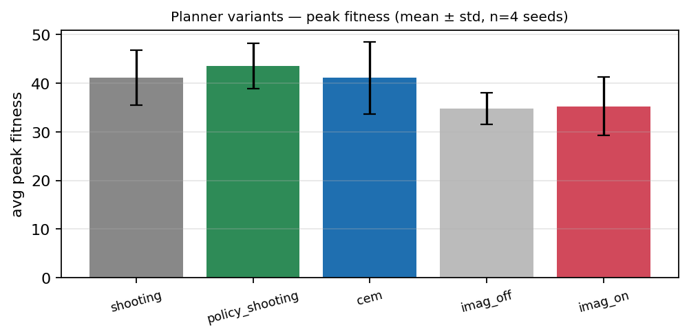

# Planner upgrades — multi-seed replication (the honest picture)

The P1/P2/P3 write-ups (`docs/sample_planning_p{1,2,3}/`) each reported a
**single-seed** A/B. This is the **4-seed replication** (seeds 1–4) of all five
variants under identical conditions (64×64, v3.5 + PPO, 2000 ticks). It is the
authoritative result; the single-seed numbers should be read as anecdotes.

## Results (mean ± std over 4 seeds)

| variant | n | peak fitness | final fitness | lifespan | tiles/agent | EAT | seeds | ticks/s |
|---|---|---|---|---|---|---|---|---|
| shooting (baseline) | 4 | 41.1 ± 5.7 | 45.3 ± 15.8 | 451.7 ± 28.5 | 41.3 ± 3.2 | 382 ± 262 | 286 ± 96 | 6.47 ± 0.61 |
| **policy_shooting (P1)** | 4 | **43.5 ± 4.6** | **51.8 ± 4.3** | 455.0 ± 17.0 | 42.8 ± 5.2 | 523 ± 218 | 354 ± 140 | 6.43 ± 0.43 |
| cem (P2) | 4 | 41.1 ± 7.4 | 34.5 ± 11.4 | 458.3 ± 32.4 | 45.1 ± 7.9 | 333 ± 209 | 318 ± 115 | 5.02 ± 0.24 |
| imag_off (P3 base) | 4 | 34.8 ± 3.3 | 38.7 ± 11.3 | 404.2 ± 30.7 | 25.9 ± 12.7 | 190 ± 118 | 212 ± 105 | 8.59 ± 0.28 |
| imag_on (P3) | 4 | 35.3 ± 6.0 | 34.8 ± 5.3 | 415.4 ± 28.6 | 28.2 ± 16.8 | 218 ± 149 | 274 ± 203 | 6.72 ± 0.15 |

(`imag_*` are planner-OFF; the others are planner-ON. )

## What replicated — and what didn't

- **P1 `policy_shooting` is the only upgrade that looks reliably good.** Highest
  mean peak fitness (43.5 vs 41.1) **and** the best, *most stable* final-generation
  fitness (51.8 ± 4.3 vs the baseline's 45.3 ± **15.8**), with more eating and
  planting, at **equal cost**. Its standout property across seeds is **variance
  reduction** — the policy-guided value estimate makes outcomes consistent. The
  single-seed "+21% peak" overstated it; the robust read is "modestly higher and
  much steadier."
- **P2 `cem` did NOT replicate.** The single-seed +32% was seed luck (seed 1 was
  great, seed 3 poor): across 4 seeds CEM ties the baseline on peak (41.1) and is
  *worse* on final fitness (34.5), while running ~20% slower. At this budget/scale
  the extra search is not justified.
- **P3 imagination did NOT replicate.** `imag_on ≈ imag_off` (peak 35.3 vs 34.8;
  final 34.8 vs 38.7) — no reliable benefit. The single-seed +25% was within noise.

## Honest caveats

- **n = 4, error bars overlap** — none of the pairwise differences are
  statistically significant; these are directional effect sizes, not proofs. P1's
  variance reduction is the most robust signal.
- Short horizon (2000 ticks) and small world (64×64, pop 30). P2/P3 plausibly need
  a **better-trained world model and longer horizons** to pay off (the proposal's
  deferred model-error discipline targets exactly the regime where CEM/imagination
  over-trust an immature model). These results bound the *current* benefit, not the
  ceiling.

## Disposition

All three phases stay **implemented, tested, and config-gated with the legacy
`shooting` controller as the default**. Based on this replication, **P1
(`policy_shooting`, exploratory first action) is the recommended planner setting**;
P2/P3 remain available and opt-in but are not recommended by default at this scale.

## Reproduce

```bash
bash  # 5 variants × seeds 1–4, 2000 ticks each (see the sweep script)
# raw per-run rows: results.csv ; aggregation: summary.md + the chart
```
