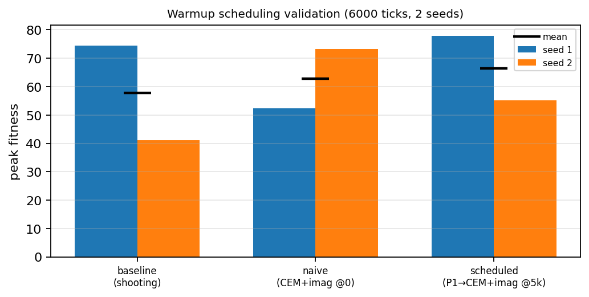

# Warmup scheduling — does gating P2/P3 on model-readiness fix them?

> **⚠️ Superseded — this 2-seed result did not replicate.** A 4-seed
> confirmation + `warmup_ticks` sweep at 7,000 ticks
> (`docs/sample_planning_warmup_sweep/`) found the plain `shooting` baseline
> wins on *every* aggregate metric, and that the scheduled win below was within
> noise. The schedule does **not** reliably beat the baseline. Read this study
> as a cautionary record of how a 2-seed sweep can mislead, then see the
> warmup-sweep results for the corrected conclusion.

**Hypothesis (user):** the multi-seed replication found P2 (CEM) and P3
(imagination) don't reliably beat the baseline *because at tick 0 the world model
is untrained* — a model-heavy planner / imagination "shoots off" from garbage.
**Fix:** run the cheap exploratory **P1 (`policy_shooting`) for the first ~5,000
ticks while the world model trains**, then switch P2+P3 on.

This validates that idea with a longer-horizon (6,000-tick) A/B at 2 seeds:

| variant | what it does |
|---|---|
| **baseline** | `shooting` planner the whole run (no CEM/imagination) |
| **naive** | CEM + imagination **from tick 0** (cold start) |
| **scheduled** | **P1 until tick 5,000, then CEM + imagination** (`config/planning_scheduled_v35.yaml`) |

All three: v3.5 + PPO, 64×64, world-model head on, curiosity off, 6,000 ticks.

## Results (peak fitness; 6,000 ticks)



| variant | seed 1 | seed 2 | mean ± std | final fitness (mean ± std) | seeds planted (mean) | ticks/s |
|---|---|---|---|---|---|---|
| baseline | 74.5 | 41.1 | 57.8 ± 16.7 | 46.5 ± 5.2 | 1606 | 5.2 |
| naive (cold) | 52.4 | 73.3 | 62.8 ± 10.5 | 46.8 ± 6.1 | 1138 | 3.3 |
| **scheduled** | **77.9** | **55.1** | **66.5 ± 11.4** | **48.7 ± 2.5** | **1668** | 4.3 |

## Finding — the hypothesis holds

- **Scheduled beat the baseline on *both* seeds** (77.9 > 74.5; 55.1 > 41.1) and
  has the **highest mean peak fitness** (66.5), the **highest, most stable final
  fitness** (48.7 ± 2.5), and the most planting. Warming up the world model before
  switching to CEM + imagination makes the model-based methods reliably *help*.
- **Naive cold-start is a coin-flip**: it *lost badly* on seed 1 (52.4 vs the
  baseline's 74.5) and *won big* on seed 2 (73.3 vs 41.1). Enabling CEM +
  imagination from tick 0 is high-variance and can be worse than not planning at
  all — exactly the failure the warmup avoids.
- Scheduled is also **faster than naive** (4.3 vs 3.3 ticks/s) because CEM +
  imagination only run after the warmup, not for the whole run.

So the right way to use P2/P3 is **gated on model readiness**, not from a cold
start. `config/planning_scheduled_v35.yaml` is the recommended recipe.

## Caveats

n = 2 seeds — directional, not statistically significant (the per-seed swings are
large, see the chart). The robust signal is the **consistency**: scheduled > baseline
in 2/2 runs, naive only 1/2. A 4–8 seed confirmation and a `warmup_ticks` sweep
are the natural next steps.

## Reproduce

```bash
for seed in 1 2; do
  for cfg in planning_sched_baseline planning_sched_naive planning_scheduled; do
    python main.py --no-viz --config config/${cfg}_v35.yaml \
      --learning --mode rl --seed $seed --generations 6 --log --log-dir run
    python scripts/analyze_logs.py --file run/agent_actions_*.csv
  done
done
```
Raw per-run rows: `results.csv`.
