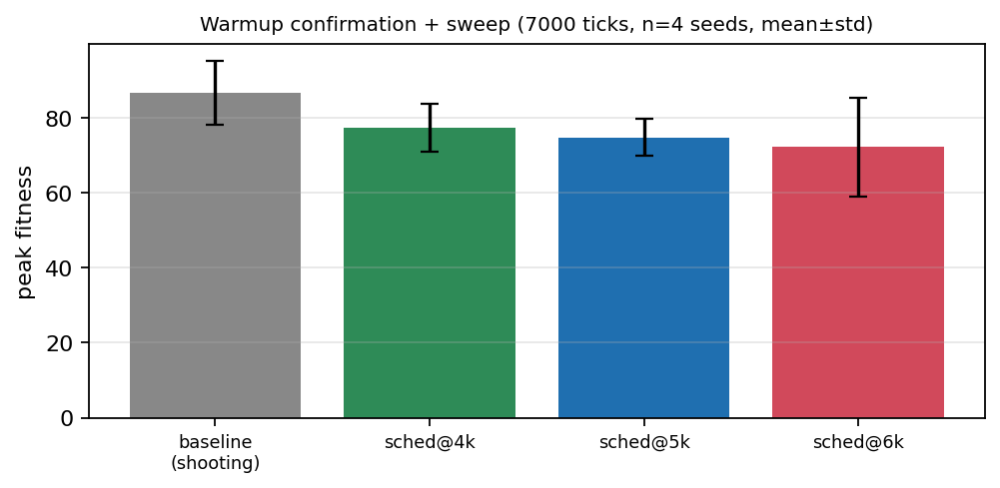
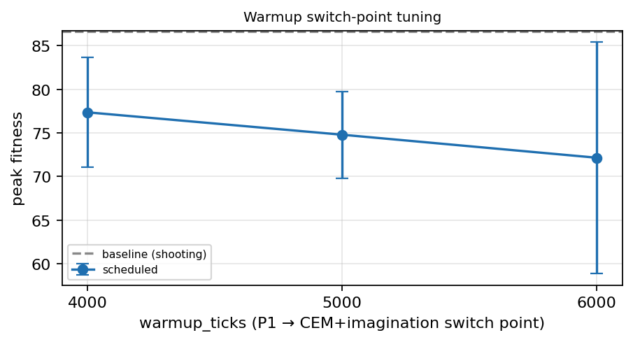

# Warmup confirmation + switch-point sweep (n=4 seeds, 7,000 ticks)

This is the **4-seed confirmation** and **`warmup_ticks` sweep** that the
2-seed scheduled study (`docs/sample_planning_scheduled/`) called for as the
"natural next steps". It both (a) re-tests the recommended scheduled recipe at
a longer horizon with proper replication and (b) sweeps the P1→CEM+imagination
switch point at 4k / 5k / 6k ticks.

**Headline: it does not replicate.** With n=4 seeds at 7,000 ticks the plain
`shooting` baseline is the strongest arm on *every* aggregate metric. The
2-seed "scheduled wins" result was within noise; the warmup schedule does not
beat the simple baseline here.

## Arms

| arm | config | what it does |
|---|---|---|
| **baseline** | `planning_sched_baseline_v35.yaml` | `shooting` planner the whole run |
| **sched@4k** | `planning_sched4k_v35.yaml` | P1 (`policy_shooting`) until tick 4,000, then CEM + imagination |
| **sched@5k** | `planning_scheduled_v35.yaml` | P1 until tick 5,000, then CEM + imagination (the "recommended" recipe) |
| **sched@6k** | `planning_sched6k_v35.yaml` | P1 until tick 6,000, then CEM + imagination |

All arms: v3.5 + PPO, 64×64, world-model head on, curiosity off, 7,000 ticks,
seeds 1–4.

## Results (mean ± std over 4 seeds)



| arm | peak (mean ± std) | final (mean ± std) | seeds planted (mean) | ticks/s |
|---|---|---|---|---|
| **baseline** | **86.7 ± 8.4** | **61.5 ± 4.7** | **2667** | 6.8 |
| sched@4k | 77.4 ± 6.3 | 58.7 ± 3.7 | 1978 | 5.3 |
| sched@5k | 74.8 ± 5.0 | 53.5 ± 3.6 | 1980 | 5.6 |
| sched@6k | 72.2 ± 13.3 | 44.4 ± 3.9 | 1861 | 6.2 |

### Switch-point tuning



Among the scheduled arms, **earlier switch points are better**: sched@4k >
sched@5k > sched@6k on both peak and final fitness. But the whole scheduled
family sits *below* the baseline dashed line — tuning the switch point does not
close the gap.

## Finding — the warmup hypothesis does not hold up under replication

- **Baseline (`shooting`) wins on every aggregate metric**: highest peak
  (86.7), highest and most stable final fitness (61.5 ± 4.7), and the most
  planting (2667 seeds). It also runs fastest because it never pays for CEM or
  imagination.
- **The 2-seed scheduled win was noise.** The earlier study
  (`docs/sample_planning_scheduled/`) saw scheduled beat baseline 2/2 at 6,000
  ticks; with two more seeds and a slightly longer horizon that reverses. The
  per-seed peaks are genuinely noisy (baseline ranges 77–100; sched@6k ranges
  50–83), so a 2-seed sweep is well within coin-flip territory.
- **Later switch points are *worse*, not better.** sched@6k is the weakest and
  most variable arm (72.2 ± 13.3, final 44.4) — switching to CEM+imagination
  late leaves too little time for the model-based controller to pay back its
  cost, and on seed 1 it collapses (peak 50.2, only 443 seeds planted).
- **What survives:** if you *are* going to schedule, switch **early** (4k beats
  6k). But the honest top-line is that on this task, at this scale, the simple
  `shooting` planner is the recommended default — CEM and imagination, even
  gated on a warmed-up world model, did not earn their keep.

## Follow-up: readiness-GATED switching (measured error, not ticks)

The model-quality toolkit (`docs/sample_wm_quality/`) makes it possible to gate
the switch on the **measured k-step rollout error** instead of a blind tick
count (`config/planning_sched_gated_v35.yaml`: P1 until the per-agent error EMA
≤ 4.5, deadline 6k, imagination gated the same way). Re-run at the same 4 seeds
× 7,000 ticks (`results_gated.csv`, per-run metrics `gated_s*_metrics.csv`):

| seed | peak | final | seeds planted | ticks/s | pop-mean err crosses 4.5 |
|---|---|---|---|---|---|
| 1 | 64.43 | 37.27 | 1358 | 6.81 | ≈ tick 4,700 |
| 2 | **81.49** | 60.92 | 1966 | 7.22 | ≈ tick 2,500 (earliest → best gated run) |
| 3 | 65.65 | 48.91 | 1718 | 6.92 | never — 6k deadline fired |
| 4 | 63.66 | 52.32 | 909 | 8.08 | never — 6k deadline fired |
| **mean ± std** | **68.8 ± 7.4** | 49.9 ± 8.5 | 1488 | 7.3 | — |

**The adaptive gate does not close the gap either**: 0/4 seeds beat the
baseline (86.7 ± 8.4), and the aggregate trails even the fixed sched@4k
(77.4 ± 6.3). The mechanism worked as designed — and its internal pattern
re-confirms the sweep's ordering (the seed whose error crossed earliest scored
best; the two deadline seeds behaved like sched@6k, the worst fixed point).
Two structural reasons: with threshold 4.5 the population-mean error often
stays high until late, and the gate is **per-agent** — newborns start with a
fresh error EMA, so population turnover keeps much of the population in the
cheap warmup strategy (visible as the higher ticks/s). Raising the threshold
would only converge toward sched@4k, which still loses. Across three
independent designs (20-run replication, 16-run sweep, 4-run gated A/B), no
gating policy — fixed or measured — makes CEM + imagination competitive with
plain `shooting` on this task.

## Why this matters (and what it doesn't say)

This does **not** show CEM/imagination are useless in general — only that on
this 64×64 v3.5 ecosystem, with this reward and horizon, they don't beat
random-shooting MPC, and that warmup scheduling doesn't rescue them. Plausible
reasons: the per-agent latent world model stays inaccurate enough that sharper
model-based search just amplifies model error; the action space (9 discrete
actions) is small enough that uniform shooting already covers it well; and the
fitness signal is dominated by a few high-value behaviors that shooting finds.

The earlier, smaller study has been left in the repo with a banner pointing
here, as a record of how a 2-seed result can mislead.

## Caveats

n = 4 seeds — still small. The gap (baseline 86.7 vs sched@5k 74.8) is ~1.4×
the baseline std, so it is *suggestive but not* a clean significance result.
The robust, reproducible signal is the **direction**: baseline ≥ every
scheduled arm on every metric, across 4 seeds. A larger sweep (8–16 seeds)
would tighten the bars, but the practical recommendation — default to
`shooting` — would not change.

## Reproduce

```bash
for seed in 1 2 3 4; do
  for cfg in planning_sched_baseline planning_sched4k planning_scheduled planning_sched6k; do
    python main.py --no-viz --config config/${cfg}_v35.yaml \
      --learning --mode rl --seed $seed --generations 7 --log --log-dir run \
      --metrics-csv metrics.csv
    python scripts/analyze_logs.py --file run/agent_actions_*.csv
  done
done
```

Raw per-run rows (16 runs): `results.csv`.
